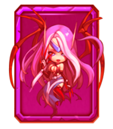
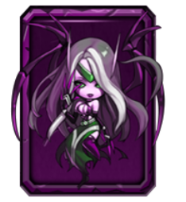
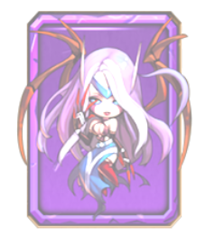
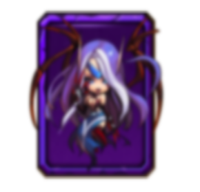

## 1.发光滤镜

### 1.1.说明
使用 `GlowFilter` 类可以对显示对象应用发光效果。发光样式的选项包括内侧发光、外侧发光以及挖空模式。   
这里创建一个函数用来对传入的显示对象用给定的参数进行发光滤镜处理。    
在接下的示例代码中，要传给滤镜的参数，将首先以局部变量的方式定义，并把每个参数的含义在注释部分进行说明。然后将这些参数填充到滤镜的构造函数相应位置。注意，为了结构清晰便于理解代码，所定义的局部变量与滤镜的构造函数参数将一一对应，并且顺序也是完全一致的。   

### 1.2.设置
白鹭小鸟在程序中用一张位图表示：   
```var img:egret.Bitmap;```    

创建滤镜：  
  
```     
var color:number = 0x33CCFF;        /// 光晕的颜色，十六进制，不包含透明度
var alpha:number = 0.8;             /// 光晕的颜色透明度，是对 color 参数的透明度设定。有效值为 0.0 到 1.0。例如，0.8 设置透明度值为 80%。
var blurX:number = 35;              /// 水平模糊量。有效值为 0 到 255.0（浮点）
var blurY:number = 35;              /// 垂直模糊量。有效值为 0 到 255.0（浮点）
var strength:number = 2;            /// 压印的强度，值越大，压印的颜色越深，而且发光与背景之间的对比度也越强。有效值为 0 到 255。暂未实现
var quality:number = egret.BitmapFilterQuality.HIGH;        /// 应用滤镜的次数，建议用 BitmapFilterQuality 类的常量来体现
var inner:boolean = false;            /// 指定发光是否为内侧发光，暂未实现
var knockout:boolean = false;            /// 指定对象是否具有挖空效果，暂未实现

var glowFilter:egret.GlowFilter = new egret.GlowFilter( color, alpha, blurX, blurY,
    strength, quality, inner, knockout );
```

最后对位图对象应用发光滤镜：    
```   
img.filters = [ glowFilter ];
```

### 1.3.效果
如图是使用滤镜前后的效果对比：       
![egret-bird-filter-no][]      ![egret-bird-filter-glow][]      

[egret-bird-filter-no]: egret-bird-filter-no.png
[egret-bird-filter-glow]: egret-bird-filter-glow.png

## 2.颜色矩阵滤镜

### 2.1.说明
ColorMatrixFilter--颜色矩阵滤镜(egret.ColorMatrixFilter) 在颗粒等级上提供更好的控制显示对象的颜色转换方式。ColorMatrixFilter为 4行5列的多维矩阵(20个元素的数组)。下图为等效的矩阵。
 
 
 
 
### 2.2.设置
 
下面是一个图片灰度化的示例。首先准备一张图片：
 
 
 
然后通过下面颜色转换矩阵代码添加一个“灰度化”的效果:
 
```
var hero:egret.Bitmap = new egret.Bitmap();
hero.texture = RES.getRes("hero_png");
this.addChild(hero);
//颜色矩阵数组
var colorMatrix = [
    0.3,0.6,0,0,0,
    0.3,0.6,0,0,0,
    0.3,0.6,0,0,0,
    0,0,0,1,0
];

var colorFlilter = new egret.ColorMatrixFilter(colorMatrix);
hero.filters = [colorFlilter];
```

在上述示例中，首先新建了一个显示对象，然后新建了一个颜色转换矩阵 `ColorMatrixFilter`,并通过显示对象的 `filters` 属性来设置滤镜。显示对象的 `filters` 属性包含当前与显示对象关联的每个滤镜对象的索引数组。
 
实现效果的关键是颜色转换矩阵的设置。上面我们将每个颜色通道都乘相同的系数来实现灰度效果。

### 2.3.效果

 
 
> 通过 ColorMatrixFilter 的 matrix 属性可以设置颜色矩阵。需要注意的是不能直接通过 `colorFlilter.matrix[4] = 100;` 这样的方式直接修改颜色矩阵。只能通过获得数组的引用然后修改,最后重置矩阵：

```
//获得数组。
var test = colorFlilter.matrix;
//修改数组中的值。
test[4] = 100;  
//重置矩阵。
colorFlilter.matrix = test;
```

### 2.4.矩阵数据说明

在上面例子中我们实现了灰度图的效果，下面介绍颜色矩阵的含义：


实际的颜色值由下面的公式决定：

``` 伪代码
redResult   = (a[0] * srcR)  + (a[1] * srcG)  + (a[2] * srcB)  + (a[3] * srcA)  + a[4];
greenResult = (a[5] * srcR)  + (a[6] * srcG)  + (a[7] * srcB)  + (a[8] * srcA)  + a[9];
blueResult  = (a[10] * srcR) + (a[11] * srcG) + (a[12] * srcB) + (a[13] * srcA) + a[14];
alphaResult = (a[15] * srcR) + (a[16] * srcG) + (a[17] * srcB) + (a[18] * srcA) + a[19];
```

公式中 srcR、srcG、srcB、srcA 表示原始显示对象的像素值, a 是颜色矩阵。新的红绿蓝和alpha通道实际由颜色矩阵和原始图片的像素值同时决定。颜色矩阵中的 Off 可以直接设置偏移量加上相应的 R G B A 的值的乘积即为最终的颜色值。所以与原来完全相同的矩阵转换应该是下面这样的：

```
var colorMatrix = [
    1,0,0,0,0,
    0,1,0,0,0,
    0,0,1,0,0,
    0,0,0,1,0
];
```

下面是几个颜色矩阵设置示例：

#### 设置红色偏移量

在颜色矩阵中直接设置每一行中最后一个值即可设置偏移量，直接设置红色通道的偏移量，结果整张图片变红。

```
var colorMatrix = [
    1,0,0,0,100,
    0,1,0,0,0,
    0,0,1,0,0,
    0,0,0,1,0
];
```

修改代码中的颜色矩阵数组，编译运行得到如下效果图：



> 需要注意的 R G B 通道对应的偏移量的值应该为 -255 ~ 255，Alpha 通道对应的偏移量取值范围为 -255 ~ 255.应避免传入除数字外其他类型的值，比如字符串等。

#### 绿色加倍

如果想使绿色通道加倍,colorMatrix[6] 加倍即可：

```
var colorMatrix = [
    1,0,0,0,0,
    0,2,0,0,0,
    0,0,1,0,0,
    0,0,0,1,0
];
```


#### 红色决定蓝色值

如果要使结果图像中的蓝色与原图的红色数量相等，将colorMatrix[10]设为1， colorMatrix[12]设为0 ,即结果的蓝色值完全由原始的红色值决定：

```
var colorMatrix = [
    1,0,0,0,0,
    0,1,0,0,0,
    1,0,0,0,0,
    0,0,0,1,0
];
```



#### 增加亮度

增加亮度的最简单途径是给每个颜色值添加相同的偏移量。

```
var colorMatrix = [
    1,0,0,0,100,
    0,1,0,0,100,
    0,0,1,0,100,
    0,0,0,1,0
];
```




通过"颜色矩阵滤镜"可以完成除了亮度和灰度之外复杂的颜色调整，如调整对比度，饱和度和色相等。


## 3.模糊滤镜
### 3.1.设置
在 Egret 中，通过 `BlurFilter` 类设置模糊滤镜。

```
var hero:egret.Bitmap = new egret.Bitmap();
hero.texture = RES.getRes("hero_png");
this.addChild(hero);

var blurFliter = new egret.BlurFilter( 1 , 1);
hero.filters = [blurFliter];
```

和颜色转换矩阵类似，实例化一个 `BlurFilter` 并将其保存到显示对象的 `filters` 属性中即可。其中实例化 `BlurFilter` 有两个参数，即为 x 、y 方向的模糊度。 
值越大效果越模糊。

### 3.2.效果


> 需要注意的是模糊滤镜对性能的消耗比较大，应谨慎使用。普通显示对象可以开启 `cacheAsBitmap` 提高一些性能。

> 显示对象的 `filters` 属性可以保存多个滤镜效果，比如同时使用` hero.filters = [blurFliter,colorFlilter];` 模糊和颜色矩阵滤镜效果。多个效果同时生效。

## 4.投影滤镜

### 4.1.说明
阴影算法基于模糊滤镜使用同一个框型滤镜。投影样式有多个选项，包括内侧或外侧阴影和挖空模式。   

### 4.2.设置
白鹭小鸟在程序中用一张位图表示：   
```var img:egret.Bitmap;```    

创建滤镜，在定义局部变量时，对每一个参数的含义在注释部分进行简要的说明：   

 
```    
var distance:number = 6;           /// 阴影的偏移距离，以像素为单位
var angle:number = 45;              /// 阴影的角度，0 到 360 度
var color:number = 0x000000;        /// 阴影的颜色，不包含透明度
var alpha:number = 0.7;             /// 光晕的颜色透明度，是对 color 参数的透明度设定
var blurX:number = 16;              /// 水平模糊量。有效值为 0 到 255.0（浮点）
var blurY:number = 16;              /// 垂直模糊量。有效值为 0 到 255.0（浮点）
var strength:number = 0.65;                /// 压印的强度，值越大，压印的颜色越深，而且阴影与背景之间的对比度也越强。有效值为 0 到 255。暂未实现
var quality:number = egret.BitmapFilterQuality.LOW;              /// 应用滤镜的次数，暂无实现
var inner:boolean = false;            /// 指定发光是否为内侧发光
var knockout:boolean = false;            /// 指定对象是否具有挖空效果

var dropShadowFilter:egret.DropShadowFilter =  new egret.DropShadowFilter( distance, angle, color, alpha, blurX, blurY,
    strength, quality, inner, knockout );
```   

最后对位图对象应用投影滤镜：     
```  
img.filters = [ dropShadowFilter ];
```

### 4.3.效果
下图是使用滤镜前后的效果对比：       
![egret-bird-filter-no][]      ![egret-bird-filter-shadow][]      

对比发光滤镜，可以看到投影滤镜的构造函数正好比发光滤镜多出前两个参数：`distance` 和 `angle` 。在投影滤镜的 `distance` 和 `angle` 属性设置为 0 时，投影滤镜与发光滤镜极为相似。   

[egret-bird-filter-no]: egret-bird-filter-no.png
[egret-bird-filter-shadow]: egret-bird-filter-shadow.png