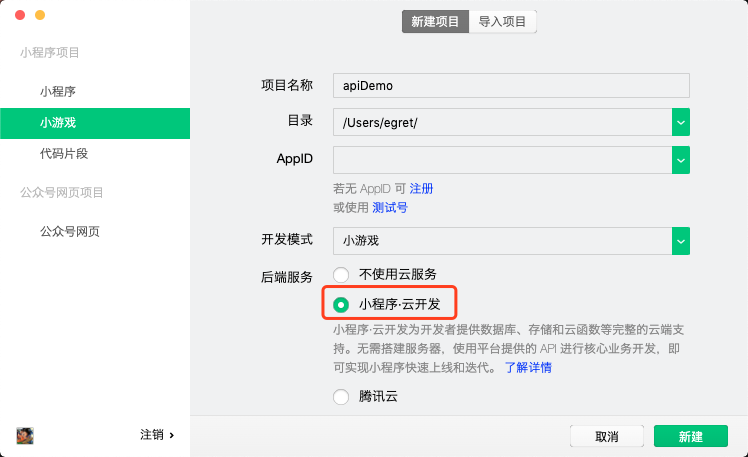
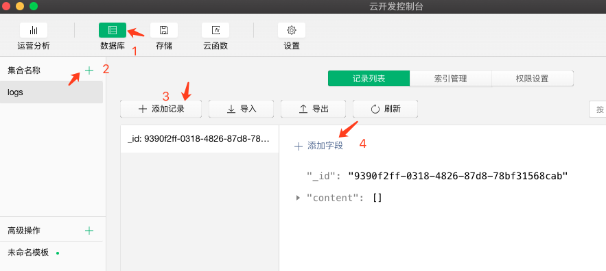
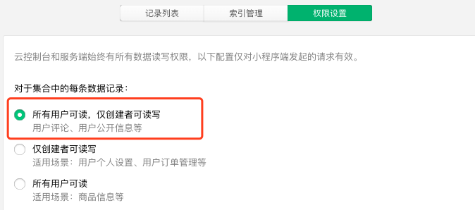
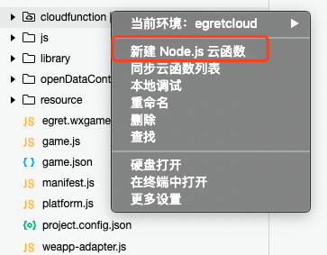

# 微信小游戏数据库API

开发者可以使用腾讯云提供的能力，在游戏里直接调用API，就可以操作数据库的读写存储等功能，无需搭建服务器。提高开发效率，节约成本。
[云开发介绍](https://developers.weixin.qq.com/minigame/dev/wxcloud/basis/getting-started.html) [数据库操作API](https://developers.weixin.qq.com/minigame/dev/wxcloud/reference-client-api/database/)

### 一.使用前准备：开通云开发功能   
* 1.创建一个新的小游戏项目，勾选 `小程序.云开发`。 **注意：不能使用测试号**



* 2.在左上方的工具栏里点击`云开发`


* 3.在弹出的面板里点击`开通`,后续配置一些参数


* 4.云开发功能开通完成后，在老项目的 `project.config.json` 中增加一个字段 `"cloudfunctionRoot": "cloudfunction/"`，指定云函数的本地目录

### 二.设置数据库
* 1.打开云开发控制台 -> 数据库 -> `+` 创建一个名为 `logs` 的集合名称。
* 2.点击 `添加记录`，使用系统自动生成的 id 创建一条记录。这个 id 在代码中会使用到。
* 3.点击 `添加字段`，字段名称为 `content`，类型为 `array`

* 4.切换到 `权限设置`面板，把权限设置为 `所有用户可读，仅创建者可读写`



### 三.创建云函数
因为数据库的权限问题，普通用户要想写入数据，必须使用云函数

* 1.首先在微信小游戏项目中创建一个 `cloudfunction` 文件夹，就是我们刚才在 `project.config.json` 中配置的。然后在微信开发者工具中右键单击这个文件夹,选择 `新建 Node.js 云函数`，然后创建一个名为 `addLog` 的云函数文件夹




* 2.将 `addLog` 文件夹内的 `index.js` 代码修改如下：

```
// 云函数入口文件
const cloud = require('wx-server-sdk')
cloud.init()
// 云函数入口函数
exports.main = async (event, context) => {
  let newValue = event.value;
  //获取数据库的引用
  const db = cloud.database()
  //获取数据库中的数组
  let oldData = await db.collection('logs').doc('9390f2ff-0318-4826-87d8-78bf31568cab').get()
  //获取内容的数组
  let content = oldData.data.content
  //加入新的数据
  content.push(newValue)
  //更新服务器上的数据
  let newData = await db.collection('logs').doc('9390f2ff-0318-4826-87d8-78bf31568cab').update({
    data:{
      content:content
    }
  })
  return newData
}
```
* 3.右键在 `addLog` 文件夹上点击 `上传并部署：云端安装依赖`


### 四.代码调用
* 1.增加服务器上的数据，只要调用刚才创建的 `addLog` 云函数就可以了。

```
wx.cloud.callFunction({
    name: "addLog",
    data: {
        value: "abc" + Math.floor(Math.random() * 100)
    },
    success: function (res): any {
        console.log("增加信息成功", res.result)
    },
    fail: function (err): any {
        console.log("err", err)
    }
})
```
* 2.获取服务器上的数据

```
const db = wx.cloud.database()

db.collection('logs').doc('9390f2ff-0318-4826-87d8-78bf31568cab').get().then(res => {
    console.log('获取数据', res.data.content)
})
```

本示例演示了如何增加和查询数据，前端调用 API 即可，不需要后端的开发工作，简化了开发流程。

访问官网查询更多的[数据库操作API](https://developers.weixin.qq.com/minigame/dev/wxcloud/reference-client-api/database/)

[本示例Demo的下载地址](http://tool.egret-labs.org/DocZip/engine/tencent/cloudapi.zip) 需要将里面的 appID 和数据库相关参数修改成您自己的才可以测试使用。