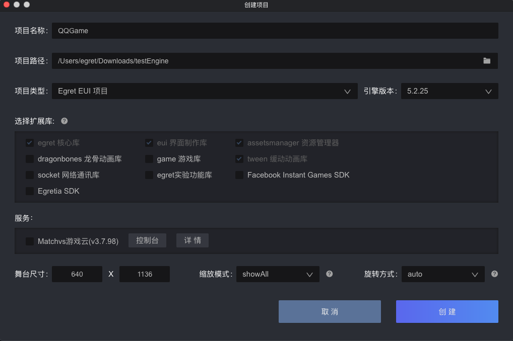
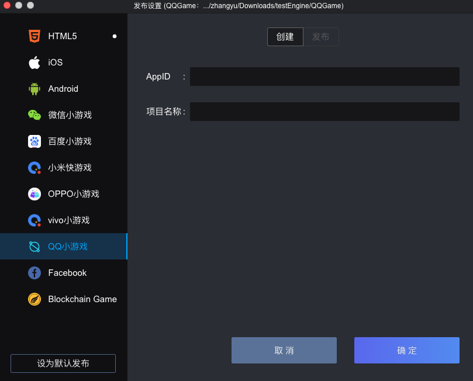
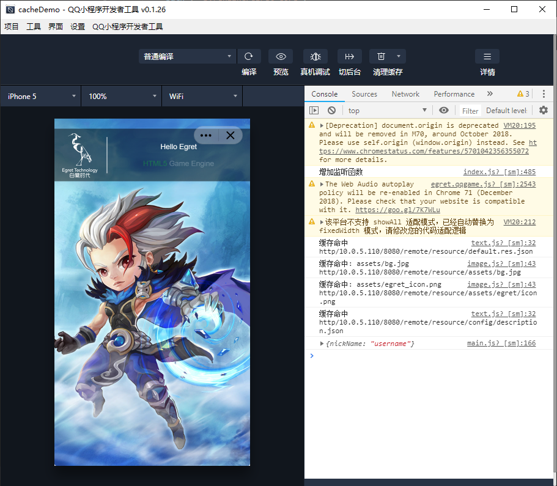

### 一.开发环境准备

* Egret Launcher 1.0.67 以上版本
* 白鹭引擎 5.2.25 以上版本
* 下砸安装 QQ 小游戏开发者工具[下载地址](https://q.qq.com/wiki/#_4-%E7%BC%96%E7%A0%81%E5%BC%80%E5%8F%91%E5%B0%8F%E7%A8%8B%E5%BA%8F)
* 更多 QQ 小游戏 API 文档，请访问小游戏支持网站：[网站地址](https://q.qq.com/wiki/develop/game/API/)

### 二.创建小游戏和可视化编译打包小游戏

1. 使用最新的 Egret Launcher 创建一个 Egret 游戏项目，引擎使用 5.2.25 以上版本。
创建完成后，会在 Egret Launcher 的列表里看到该项目。点击发布设置:

2. 选择 `QQ 小游戏` 标签，点击`确定`，创建项目

3. 创建成功后，点击`发布`标签，可以可视化的发布小游戏包

	* 编译游戏代码到小游戏：相当于执行命令 `egret build --target qqgame`，把游戏的代码编译到小游戏的项目里


### 三.使用命令行把白鹭游戏编译到小游戏项目
#### 方法1：开发者可以使用命令行来编译和发布到 qq 小游戏项目中：
	
  * dubug 模式： ```egret build --target qqgame```
  * release 模式： ```egret publish --target qqgame```

#### 方法2：配置 egretProperties.json

```
"engineVersion": "5.2.25",
"compilerVersion": "5.2.25",
"template": {},
"target": {
	"current": "qqgame"
},
```

如上所示，将 `egretProperties.json` 配置文件中的 `current` 属性设置为 `qqgame` 时，可以直接使用```egret build``` 或者 ```egret publish``` 命令编译和发布 QQ 小游戏。

现在就可以在开发者工具中运行小游戏了，如在开发中遇到任何问题都可到官方论坛提问，官方团队很愿意为您解答
